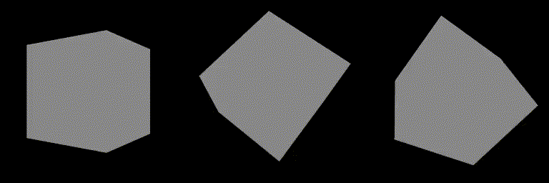
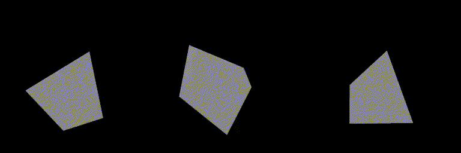
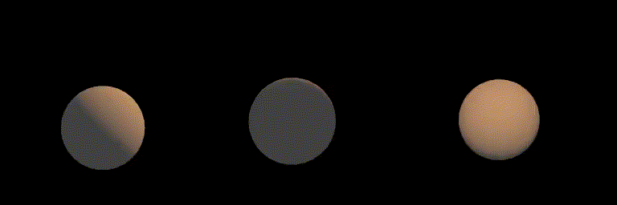

Проект по созданию кросс-платформенного дифференцируемого рендера

Все зависимости проекта на данный момент опциональны. Вы можете собрать программу
без них.

1) Базовый вариант (без зависимостей)
 - установить clang
 - cmake CMakeLists.txt -DDEBUG=OFF -DUSE_EMBREE=OFF -USE_OPENMP=OFF -DUSE_MITSUBA=OFF -DUSE_ENZYME=OFF -DCLANG_VERSION=9
 - версия clang может быть другой, но не ниже 9
2) Embree - самая критичная зависимость, без нее скорость работы рендера ОЧЕНЬ низкая
 - по идее, никаких дополнительных действий не требуется, только установить -DUSE_EMBREE=ON
3) OpenMP - существенно ускоряет вычисления на CPU
 - для clang в данный момент нужно указывать в CMake две переменные: AUX_OMP_INC и AUX_OMP_LIB
 - нужные пути можно получить при помощи команд 'locate omp.h'' и 'locate libomp.so' 
4) Mitsuba - сейчас используется только в тестах, как референс для нашего рендера
 - установить python (проверено на версии 3.8)
 - python -m pip install mitsuba
5) Enzyme - библиотека автоматического дифференцирования
 - установить llvm (должно поставиться вместе с clang)
 - собрать enzyme https://enzyme.mit.edu/Installation/
   * исходники уже лежат в external/enzyme
   * на Ubuntu 23 можно использовать такую команду: 'cmake -G Ninja .. -DLLVM_DIR=/usr/lib/llvm-16/share/llvm/cmake/ -DClang_DIR=/usr/lib/llvm-16/lib/cmake/clang/'  
 - указать правильную версию clang -DCLANG_VERSION=...

рекомендуемая сборка:
cmake CMakeLists.txt -DCMAKE_BUILD_TYPE=Release -DDEBUG=OFF -DUSE_EMBREE=ON -DUSE_OPENMP=ON -DUSE_MITSUBA=ON -DUSE_ENZYME=ON -DCLANG_VERSION=9

Примеры тестоовых оптимизаций: 
  
  
  

